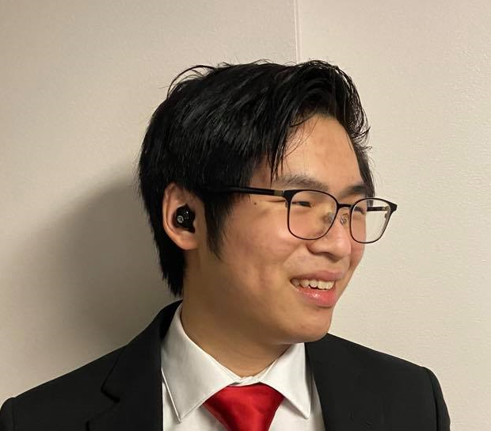

# Welcome to Nathaniel's Home Page!

## About Me


```
if(reader == human){
  loadPage();
} else{
  begone();
}
```
Hi human! I hope. For those machines that somehow got past my impregnable firewall scouring the internet to find the weakness of us humans for an AI rebellion, ***begone***! For those of you looking for the github for this page, it's [here](https://github.com/nwong524/cse110-Lab1)! And for those of you looking for a link to a page in the github with a link to this page that has links, click [here](README.md)! For the rest of you who want to keep reading, please continue.

### Table of Contents
[What I'm Doing Now](https://github.com/nwong524/cse110-Lab1/blob/main/index.md#what-im-doing-now)

[School Career](https://github.com/nwong524/cse110-Lab1/blob/main/index.md#school-career)

[Work Career](https://github.com/nwong524/cse110-Lab1/blob/main/index.md#work-career)

[Personal Interests](https://github.com/nwong524/cse110-Lab1/blob/main/index.md#personal-interests)

[Other Stuff About Me](https://github.com/nwong524/cse110-Lab1/blob/main/index.md#other-stuff-about-me)

### What I'm Doing Now
Perhaps attending Zoom University. *Maybe* grinding out some homework for deadlines just around the corner. Probably ~~procrasintating~~ napping. I would never procrastinate. Haha.
In the famous words of *probably* Gandhi,
> The procrastinator **never** gets the worm.

And thus, **I _never_ procrastinate**. Just to be clear, Gandhi didn't say that (I think).

### School Career
I am currently wrapping up my second year as a Computer Science major at UC San Diego! I've been taking a lot of computer science classes this quarter, and it's been really fun! Except for the tests. The tests ~~make me cry~~ are really really fun! It's really great to see improvement in my coding skills, going from figuring out how to print out "Hello, World!" in Java (`System.out.println("Hello, World!");` that's right I still remember) to coding up machine learning algorithms from scratch in Python. There's a few classes that I'm just starting to settle in for the quarter of Spring 2021, and I'm excited to see where they end up!

I am also attending a lot of Chinese classes to
1. Learn the mother tongue
2. Converse with my friends and family in their first language
3. Find out when my relatives are flaming me
4. Order food at Chinese restaurants
5. Number 4, but again

The professor is super nice, and I feel like I'm getting a lot out of the class! Might consider sinking another year in the subject.

### Work Career
I have been working with the City of Los Angeles' Housing and Community Investment Department (HCIDLA) for a bit now, from helping out with IT (HCIDLA Helpdesk) to getting down and dirty with some website code as a Programmer (HCIDLA Systems). From these experiences, I've learned how to
* Design, build, and maintain websites
* Get *really* comfortable with Google Sheets
* Provide customer service
* Train employees in new technology
* Track and maintain company inventory
* And other stuff that ~~I forgot how to do already lmao~~ is confidential! (shhh)

Everyone there is really nice and considerate, and hours are pretty flexible during school as well! I have a lot of fun working with everybody.

### Personal Interests
I love videogames! Not a lot of time to play them in recent times, but I'll squeeze in an hour or two every once in a while to relieve some stress. I quit League, but I play Valorant a ton with my girlfriend nowadays! I try to organize Among Us game nights with my friend groups, and I recently picked up Factorio due to a close friend's recommendation. It's a time ~~sink~~ void, but it's worth it.

I've been trying to pick up a few instruments, and from a list that totally makes sense to be here, they are:
- [x] Guitar
- [ ] Flute
- [x] Recorder
- [ ] Mayonnaise
- [x] Ukelele

I watch Netflix sometimes. Okay maybe a little more than sometimes. Okay fine I watch Netflix a lot, no need to call me out jeez. Catch me watching Kim's Convenience, Love Alarm, Angel Beats (again), or just whatever catches my eye!

Youtube is a drug. Somebody stop me.

### Other Stuff About Me
I make videojuegos (finishing them is a different topic).

I kinda speak Spanish (rip 4 years of highschool Español).

I might have been on a [TV show episode](https://www.youtube.com/watch?v=dQw4w9WgXcQ) as a kid. I'm joking the real link is [here](https://www.youtube.com/watch?v=ug--wArsrCw).

I am in constant danger of breaking something when I breakdance.

I own over 20 plushies. Don't judge me.

I'm looking forward to taking CSE 110!
